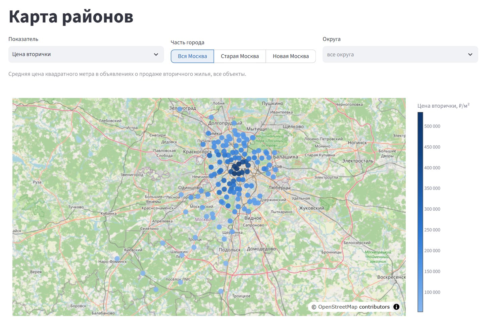
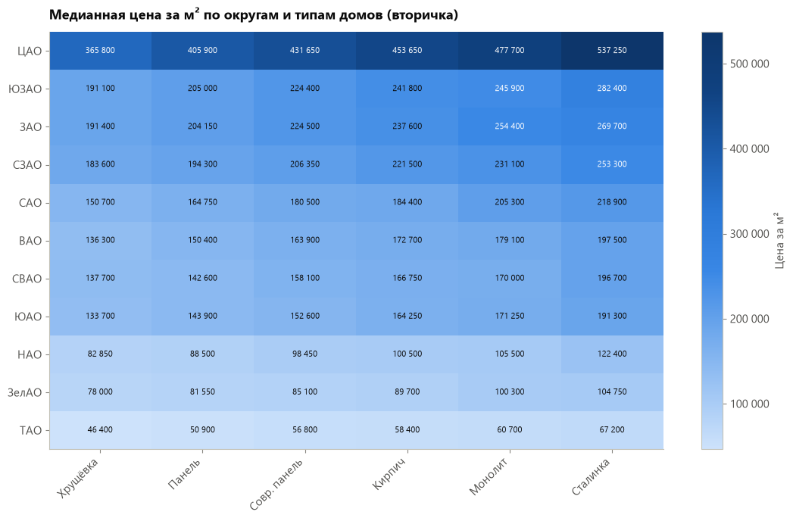
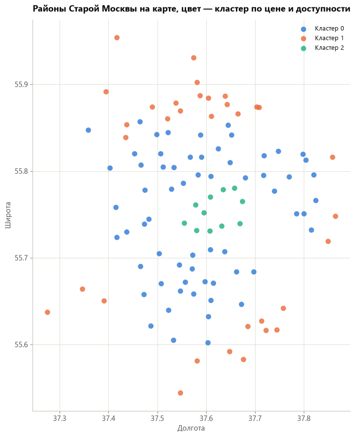
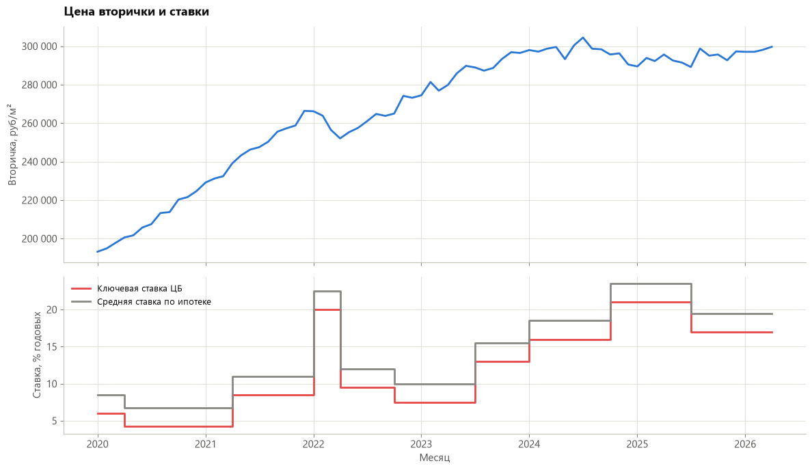
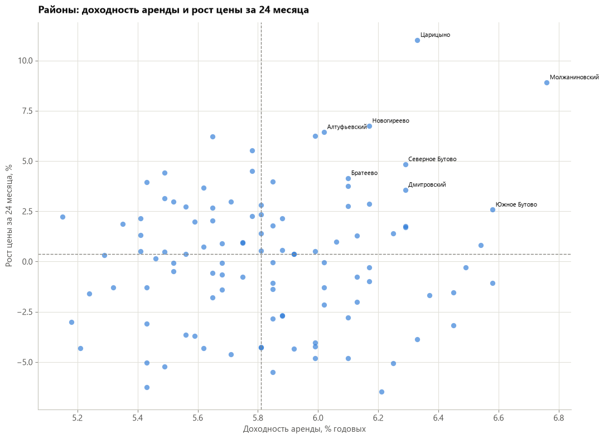
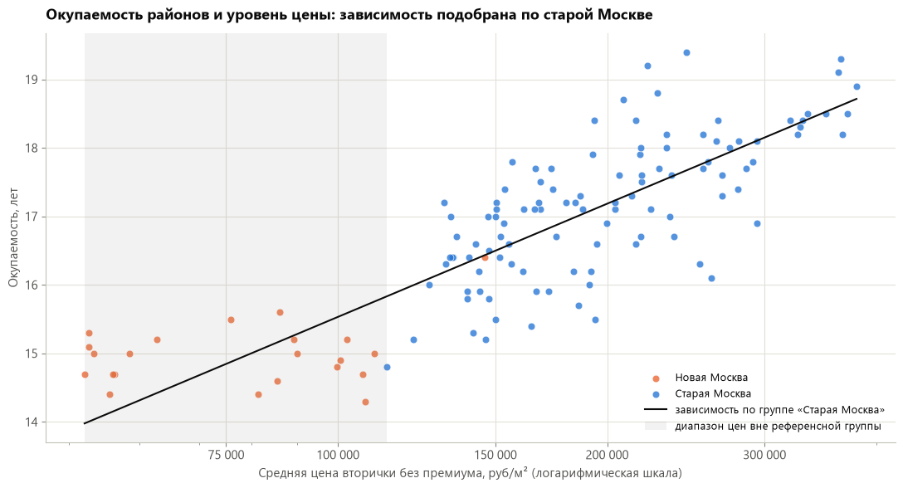
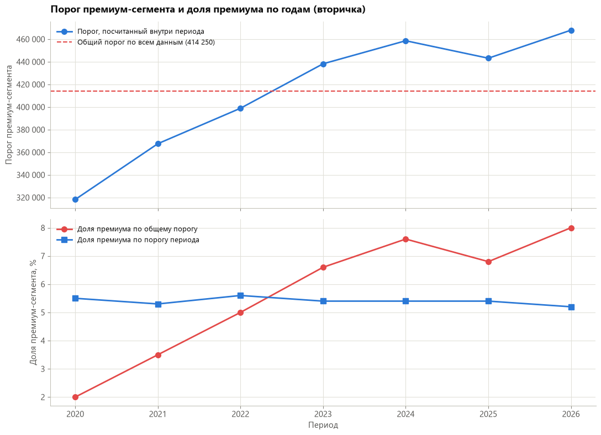

# Moscow Rent Analysis

Анализ рынка недвижимости Москвы (2020–2026): аренда, вторичное жильё и новостройки. Очистка и сегментация данных (премиум-сегмент, Новая Москва), SQL-аналитика окупаемости покупки vs аренды и наценки новостроек над вторичкой.

## Данные

Источник — датасет [Moscow Real Estate: Sales & Rentals (2020–2026)](https://www.kaggle.com/datasets/sergionefedov/moscow-real-estate-sales-and-rentals-20202026) на Kaggle, автор Sergey Nefedov, лицензия [Apache 2.0](https://www.apache.org/licenses/LICENSE-2.0). Копия исходных CSV лежит в `data/raw/` без изменений.

> **Важно: данные полусинтетические.** Реальны координаты районов и станций метро, ключевая ставка ЦБ, базовые цены по округам (привязаны к данным Росстата/Мосгорстата), хронология рыночных шоков. А сами объявления — характеристики квартир и цены — сгенерированы автором датасета гедонической моделью ценообразования. Поэтому выводы проекта описывают закономерности внутри этих данных и демонстрируют методику анализа; переносить их на реальный рынок Москвы напрямую нельзя.

Пять исходных таблиц лежат в `data/raw/`, очищенные версии — в `data/processed/`:

| Таблица | Строк | О чём |
|---|---|---|
| `rentals.csv` | 20 000 | Объявления об аренде жилья |
| `secondary_market.csv` | 50 000 | Объявления о продаже вторичного жилья |
| `new_builds.csv` | 8 000 | Объявления о продаже в новостройках |
| `district_prices_monthly.csv` | 9 804 | Официальная помесячная статистика цен по районам (независимый источник, эталон для сверки) |
| `metro_stations.csv` | 104 | Справочник станций метро |

Полное описание всех колонок каждой таблицы — в [`data/DATA_DICTIONARY.md`](data/DATA_DICTIONARY.md).

В очищенных таблицах (`rentals`, `secondary_market`, `new_builds`) есть две расчётные колонки:
- **`is_premium`** — премиум-сегмент, определён методом квартильного размаха (IQR) по цене за м² **внутри каждого года публикации**
- **`is_new_moscow`** — объект в Новой Москве (округа TAO, NAO, ZelAO)

Все таблицы дополнительно загружены в SQLite-базу `data/processed/moscow_realty.db`.

## Ключевые выводы

Выводы о рынке описывают закономерности внутри датасета (см. оговорку о полусинтетических данных выше). Подробные разборы с числами — в `notebooks/deep_analysis.ipynb`, номера разделов указаны в скобках.

**Рынок**

1. **Локация определяет цену сильнее, чем само жильё.** Хрущёвка в ЦАО (365 800 ₽/м²) дороже сталинки в любом другом округе (не выше 282 400 ₽/м²), а эконом-класс новостроек в ЦАО в 2.4 раза дороже премиум-класса в ТАО. Это подтвердили четыре независимых метода: коэффициенты регрессии, где первые девять мест заняли округа (8.1.2), важность признаков в классификаторе премиума, где расстояние до центра важнее следующего признака почти в 10 раз (8.1.3), кластеризация районов (8.3.1) и разбор «премиальных хрущёвок», 97% которых находятся в ЦАО (8.5.1).
2. **Районы делятся на три ценовых кольца.** Кластеризация по цене, расстоянию до центра и времени до метро — без координат в признаках — дала на карте три концентрических кольца: центр (медиана 415 800 ₽/м²), середина (210 300) и окраина (143 350) (8.3.1).
3. **Новая Москва — отдельный рынок, а не дешёвый край общего.** Жильё там в 2.2–2.5 раза дешевле, чем в старых границах, во всех трёх сегментах; размер эффекта 0.93 из 1 — распределения почти не пересекаются (8.6). На графиках она образует самостоятельный пик плотности (8.7).
4. **Цены выросли на 55% за 2020–2026 и с начала 2024 года стоят на плато.** Все три сегмента двигались синхронно; провалы начала 2022 и конца 2024 совпадают с подъёмами ключевой ставки до 21%, реакция цен — с задержкой около месяца (8.2.1).
5. **Центр — худший выбор для инвестиций.** Валовая доходность от сдачи — около 5.9% годовых, окупаемость — около 17 лет, и почти не зависит от числа комнат и типа дома (8.4.1). Зато в топе сводного рейтинга «доходность + рост цены» только окраинные районы, а среди восьми худших — четыре района ЦАО: премия за центр не возвращается ни через аренду, ни через рост цены (8.4.3).
6. **Новостройки дороже вторички в том же районе в среднем на 37%** при огромном разбросе между районами — от −10% до +120%. Объекты с льготной ипотекой оказались не дороже, а на 9.2% дешевле — вероятно, из-за обратной причинности: у льготной ипотеки есть потолок суммы, поэтому она доступна именно на дешёвом жилье (8.4.2).
7. **Новая Москва окупается примерно на 2 года быстрее** (медиана по районам 15.0 года против 17.2), и это держится в каждом году и внутри каждого типа дома, числа комнат и вида ремонта. Средний уровень совпадает с тем, что предсказывает её низкая цена по зависимости, найденной в старой Москве, но внутри самой Новой Москвы окупаемость от цены района почти не зависит — поэтому причина различия остаётся открытой. Наценка новостроек там выше в процентах (49.6% против 34.0%), но ниже в рублях (34 тыс. против 59 тыс. ₽/м²): процент больше только из-за низкой базы (8.8).

**Методика**

8. **Порог премиум-сегмента надо считать внутри года.** Единый порог на весь период при росте цен на 55% давал долю премиума от 2.0% в 2020 до 8.0% в 2026 — метка частично означала «объявление размещено позже». После пересчёта по годам доля стабильна: 5.2–5.6% (8.5.2–8.5.3).
9. **Статистическая значимость — ещё не находка.** Разница в аренде «с животными / без» формально значима (p = 0.000012), но размер эффекта 0.04 пренебрежимо мал: значимость дал объём выборки, а не само различие (8.6).
10. **Цены по объявлениям на 32% ниже официальной статистики, но движутся синхронно с ней** (корреляция уровней 0.996). Поэтому данные подходят для относительных сравнений — районы, надбавки, динамика, — но не для утверждений об абсолютном уровне цен (8.2.2).

## Дашборд

**Открыть: [moscow-rent-analysis.streamlit.app](https://moscow-rent-analysis.streamlit.app)** — работает в браузере, в том числе с телефона. Если приложение долго никто не открывал, оно «спит»: первое открытие займёт около минуты.

Интерактивный дашборд на Streamlit для читателя без технической подготовки: обзор рынка, карта районов с выбором показателя и рейтингом, карточка любого района, динамика цен со ставкой ЦБ и подробное сравнение старой и Новой Москвы.

```bash
pip install -r requirements.txt
streamlit run streamlit_app.py
```

Дашборд читает только витрину данных `data/mart/` (4 небольших CSV, входят в репозиторий), поэтому запускается сразу после клонирования, без прогона ноутбуков. Витрину собирает `python -m src.mart` из базы `moscow_realty.db`.

## Как запустить анализ

```bash
pip install -r requirements.txt
```

Затем выполнить шаги **строго по порядку**:

1. `notebooks/data_clean_rentals.ipynb`
2. `notebooks/data_clean_secondary_market.ipynb`
3. `notebooks/data_clean_new_builds.ipynb`
4. `notebooks/data_clean_district_prices_monthly.ipynb`
5. `notebooks/sql_loading_tables.ipynb` — собирает всё в SQLite-базу и считает итоговые выводы
6. `python -m src.mart` — собирает витрину данных для дашборда (таблицы `mart_*` в базе и CSV в `data/mart/`)
7. `notebooks/deep_analysis.ipynb` — глубокий анализ; раздел 8.8 читает витрину, поэтому после шага 6
8. `python -m src.export_figures` — выгружает ключевые графики из выполненного `deep_analysis` в `output/figures/` для README

Каждый из первых четырёх ноутбуков читает свою таблицу из `data/raw/` и сохраняет очищенную версию в `data/processed/`. Пятый — грузит все таблицы в `moscow_realty.db` и создаёт SQL-представления для аналитики.

`notebooks/surface_analysis.ipynb` — поверхностная аналитика по уже очищенным данным (распределение по комнатам, цена по возрасту дома и типу здания, влияние ремонта/мебели на аренду, класс новостроек по округам). Зависит только от `data/processed/`, запускается в любой момент после шага 4.

Запустить тесты: `pytest`

## Структура репозитория

```
Moscow_rent_analysis/
├── data/
│   ├── raw/            — исходные CSV
│   ├── processed/      — очищенные CSV + moscow_realty.db
│   ├── DATA_DICTIONARY.md — описание колонок всех таблиц
│   └── mart/           — витрина данных для дашборда (CSV)
├── output/figures/     — ключевые графики для README
├── notebooks/          — очистка данных, SQL-загрузка, поверхностная и глубокая аналитика
├── app_pages/          — страницы дашборда
├── dashboard/          — данные, графики и справочники дашборда
├── sql/                — SQL-запросы для VIEW и джойнов с метро
├── src/                — переиспользуемые Python-функции (боксплоты, сегментация, факторы цены)
├── tests/              — автотесты (pytest)
├── conftest.py
├── streamlit_app.py    — точка входа дашборда
├── requirements.txt
└── README.md
```

## Методология

- **Очистка**: приведение типов (даты, годы построек), проверка на пропуски
- **Премиум-сегмент**: метод IQR — порог = Q3 + 1.5 × (Q3 − Q1) по цене за м², отдельно в каждой таблице и **отдельно внутри каждого года публикации**

  Сначала порог считался один на весь период 2020-2026. Это оказалось ошибкой: цены за период выросли на 55%, порог остался неподвижным, и доля премиума по годам росла с 2.0% до 8.0% — то есть `is_premium` частично означал «объявление размещено позже», а не «дорогое жильё». Ошибка найдена и исправлена в разделах 8.5.2 и 8.5.3 `notebooks/deep_analysis.ipynb` — там оба разбора с числами, а сравнение «было / стало» — в трёх ноутбуках очистки. Старая функция `add_premium_flag()` оставлена в `src/segmentation.py` намеренно, чтобы расчёт по прежнему методу можно было воспроизвести.
- **Новая Москва**: выделяется по округам (TAO, NAO, ZelAO) против всех остальных
- **SQL-слой**: три представления поверх SQLite —
  - `v_payback_period` — за сколько лет аренда «окупает» покупку, по районам
  - `v_new_build_premium` — насколько новостройки дороже вторички в том же районе
  - `v_official_check` — сверка расчётов с официальной статистикой (`district_prices_monthly`)
- **Витрина данных** (`src/mart.py`): те же метрики, досчитанные по всем 129 районам, включая Новую Москву, — на районах старой Москвы значения совпадают с SQL-представлениями до последнего знака, это проверяется тестами. Средняя цена «с премиумом» и «без премиума» разведены по разным колонкам: в центре они различаются до 43%

## Визуализации

**Дашборд: карта районов.** Любой из семи показателей на карте Москвы — шесть цветовых классов, в каждом примерно поровну районов, — фильтры по части города и округам, рейтинг районов — [открыть дашборд](https://moscow-rent-analysis.streamlit.app).



**Цену определяет место, а не само жильё.** Хрущёвка в ЦАО стоит дороже сталинки в любом другом округе, а порядок типов домов по цене одинаков во всех округах — меняется только база (раздел 8.3.2).



**Три ценовых кольца.** Районы кластеризованы только по цене, расстоянию до центра и времени до метро — координат в признаках не было, но на карте кластеры легли концентрическими кольцами (8.3.1).



**Рост на 55% и плато с 2024 года.** Цена и ключевая ставка — на отдельных панелях с общей шкалой времени, а не на двух осях одного графика: связь проверена расчётом корреляции по лагам, а не на глаз (8.2.1).



**Для инвестиций центр — не лучший выбор.** Доходность аренды и рост цены за два года почти не связаны; в правом верхнем углу — окраинные районы (8.4.3).



**Новая Москва окупается быстрее.** Её средний уровень лежит на продолжении зависимости «цена — окупаемость», найденной по старой Москве, но внутри самой Новой Москвы этой зависимости нет — причина различия остаётся открытой (8.8).



**Найденная и исправленная ошибка методики.** Единый порог премиум-сегмента на весь период стоял на месте, пока цены росли, и доля «премиума» выросла с 2% до 8% только из-за даты объявления. Порог, посчитанный внутри каждого года, держит долю на уровне 5,2–5,6% (8.5.2–8.5.3).



Все графики, кроме скриншота дашборда, выгружаются из выполненных ноутбуков командой `python -m src.export_figures` — картинки в README совпадают с теми, что в анализе. Общий стиль графиков (палитра, сетка, подписи) задан в `src/plot_style.py`, те же цвета использует дашборд.

## Стек технологий

Python 3.14 · pandas · numpy · matplotlib · scikit-learn · SQLite · Jupyter Notebook · Streamlit · Plotly

## Контакты

tmarinwork@gmail.com
